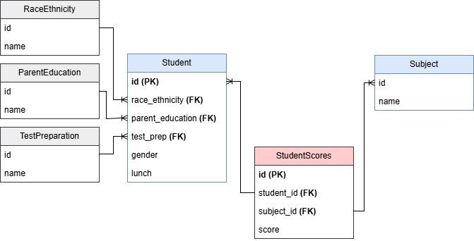
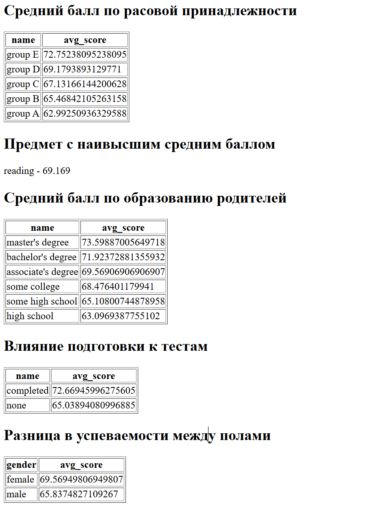
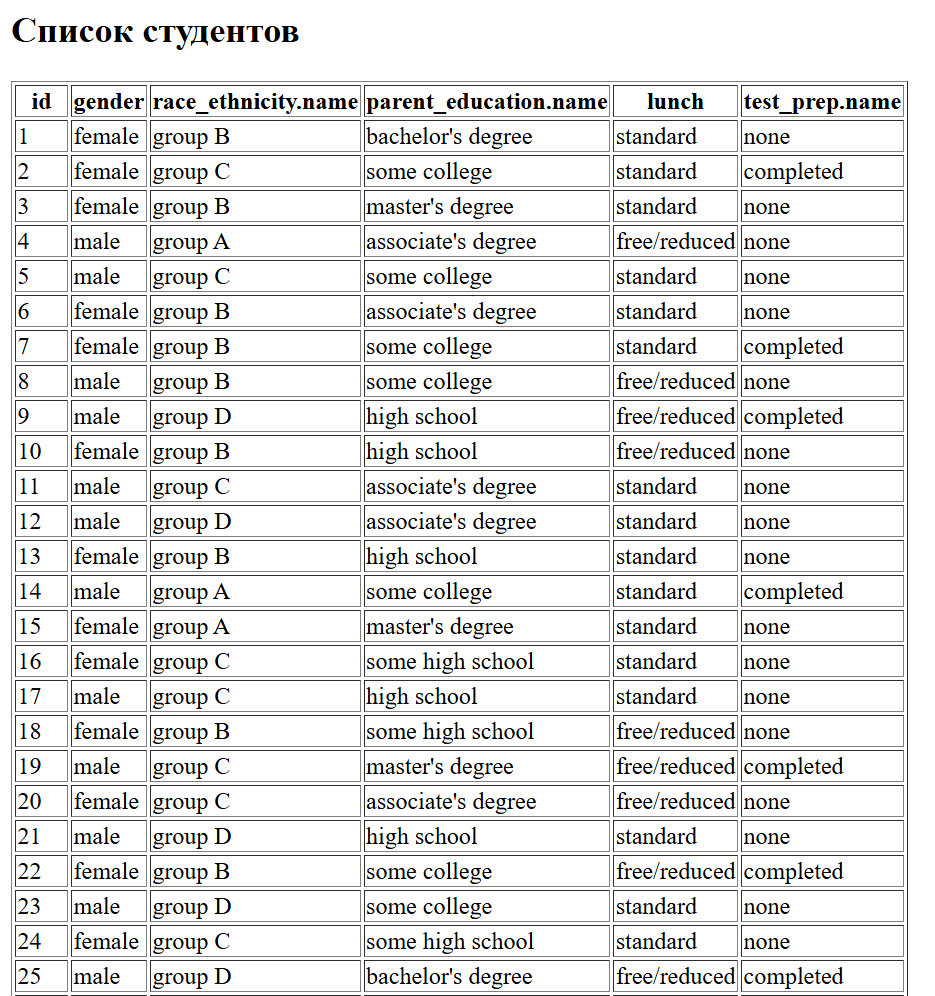

### **Описание датасета**  
Датасет **"Students Performance in Exams"** содержит данные об успеваемости студентов на экзаменах по трем предметам: математике, чтению и письму. Данные включают различную демографическую информацию, такую как пол, этническую принадлежность, уровень образования родителей, тип питания и прохождение подготовительного курса.  

📌 **Ссылка на датасет:**  
[Students Performance in Exams](https://www.kaggle.com/datasets/spscientist/students-performance-in-exams?resource=download)  

---

### **Анализ структуры данных**  
Датасет содержит следующие атрибуты:  

1. **gender** – Пол студента (male, female).  
2. **race/ethnicity** – Этническая группа (Group A, B, C, D, E).  
3. **parental level of education** – Уровень образования родителей (high school, some college, bachelor's degree и др.).  
4. **lunch** – Тип питания (standard, free/reduced).  
5. **test preparation course** – Проходил ли студент курс подготовки к экзаменам (completed, none).  
6. **math score** – Оценка по математике.  
7. **reading score** – Оценка по чтению.  
8. **writing score** – Оценка по письму.  

📌 В данных присутствуют потенциальные связи:  
- **Один-ко-многим (1:M)**:  
  - Одна этническая группа включает нескольких студентов.  
  - Один уровень образования родителей может встречаться у нескольких студентов.  
  - Один курс подготовки может быть у нескольких студентов.  
- **Многие-ко-многим (M:M)**:  
  - Один студент имеет оценки по нескольким предметам (математика, чтение, письмо).  
  - Один предмет может быть у разных студентов.  

---

### **Нормализация данных**  
Чтобы устранить избыточность и нормализовать структуру, выделим отдельные таблицы:  

#### **1. Таблица студентов (`students`)**  
| id (PK) | gender | race_ethnicity_id (FK) | parent_education_id (FK) | lunch | test_prep_id (FK) |  
|---------|--------|--------------------|---------------------|-------|---------------|  

#### **2. Таблица этнических групп (`race_ethnicity`)**  
| id (PK) | name  |  
|---------|------|  
| 1       | Group A |  
| 2       | Group B |  

#### **3. Таблица образования родителей (`parent_education`)**  
| id (PK) | name  |  
|---------|------|  
| 1       | High School |  
| 2       | Bachelor's Degree |  

#### **4. Таблица курсов подготовки (`test_prep`)**  
| id (PK) | name  |  
|---------|------|  
| 1       | Completed |  
| 2       | None |  

#### **5. Таблица предметов (`subjects`)**  
| id (PK) | name  |  
|---------|------|  
| 1       | Math |  
| 2       | Reading |  
| 3       | Writing |  

#### **6. Таблица оценок (`student_scores`)**  
| student_id (FK) | subject_id (FK) | score |  
|-----------------|---------------|------|  

### ER-диаграмма

### Результаты вывода на страницу

